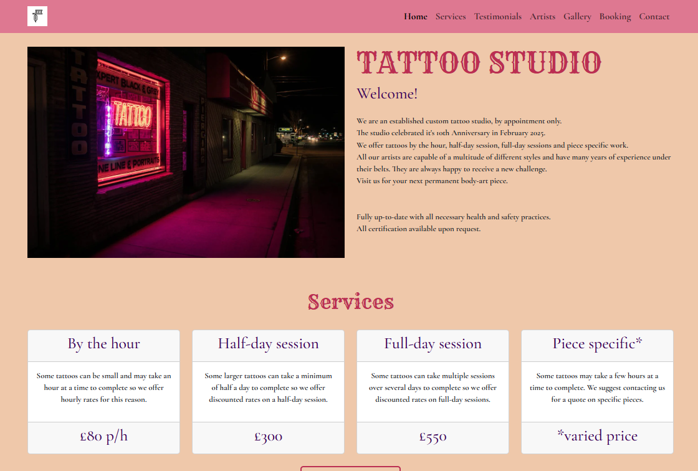

# Testing
----------

Here you will find all tests performed on the Tattoo Studio website.

to return to [README.md](README.md)

----------
## Contents
----------

* [Contrast](#contrast)
* [Lighthouse](#lighthouse)
* [Html code](#html-code)
* [CSS code](#css-code)
* [Adaptive check](#adaptive-check)
* [Home page check](#home-page-check)
* [Navigation check](#navigation-check)
* [Artist links check](#artist-links-check)
* [Gallery page check](#gallery-page-check)
* [Booking page check](#booking-page-check)
* [Success page check](success-page-check)
* [Contact page check](#contact-page-check)
* [Browser compatibility](#browser-compatibility)
* [User stories](#user-stories)

----------
### Contrast
----------

Using the chrome extension: Wave, it came to my attention that the contrast was off for the text in the navigation bar and the footer

1. Checked contrast on Wave and it was showing 7 errors.

1. Wave shows 6 contrast errors in the navigation bar.

1. Wave shows 1 contrast error in the footer.

1. I used the contrast checker on webaim.org and found that my chosen colours failed mostly everything. 

1. I used the sliding scale to adjust the background colour lightness until I saw a pass on all tests and decided to use the salmon pink colour (#de7891) that was suggested.

1. I checked the wave extension again after I used the new background colour for the navigation bar and footer and no contrast errors came up so I decided to keep the newe colour as it matched the website colour scheme really well and would not cause any issues for sight impared users.

1. The navigation bar with the new colour.

1. The footer with the new colour.

[Back to contents](#contents)

Return to [README.md](README.md)

----------
### Lighthouse
----------

Here are my findings after using the Lighthouse chrome dev. tool on the deployed Tattoo Studio website.

1. Home page

No errors to fix. 98% on performance as the image uses .img-fluid class from Bootstrap and has no set width/height.

2. Artists page

No errors to fix.

3. Gallery page

No errors to fix. 90% on performance simply because there is a short load time for each image in the carousel.

4. Booking page

No errors to fix.

5. Success page

No errors to fix. 93% on accessibility because there is a meta tag used to redirect the user back to the home page after 10 seconds.

6. Contact page

All errors seem to be pointing towards the iframe element where the interactive map is embeded.

After removing the iframe map and entering a placeholder heading for testing, the scores went up significantly.

There isn't anything I am able to fix on the map as this has been taken from google maps.
My decision to leave this in means the scores will remain as follows;
* 99% Performance, 
* 96% Accessibility,
* 78% Best Practices.

[Back to contents](#contents)

Return to [README.md](README.md)

----------
## HTML code
----------

Using W3C validation service to check my HTML code for each page of the website.

1. Home page

No errors to fix.

2. Artist page

Erros were shown for multiple use of an ID.

The same ID was used on 3 seperate artist cards.
I fixed the error by giving each artist card their own ID.

3. Gallery page

No errors to fix.

4. Booking page

No errors to fix. Only 1 warning suggesting that the form feature has no heading. I have added a heading at the top of the page to fit in with the look of the rest of the site and I do not want the form itsself to have it's own heading so I am ignoring this warning.

5. Success page

1 error to fix. There is no space between 2 attributes in one of the social media links in the footer.

I fixed the error by adding in the required space between the two attributes.

6. Contact page

No errors to fix.

[Back to contents](#contents)

Return to [README.md](README.md)

----------
## CSS code
----------

Using W3C validation service to check my CSS code for the website.

1. Check all CSS code in the custom CSS style sheet.

No errors to fix.

[Back to contents](#contents)

Return to [README.md](README.md)

----------
## Adaptive check
----------

I used dev. tools to check the adaptability of the Tattoo Studio website on different screen sizes. All worked ok and as expected.

[Back to contents](#contents)

Return to [README.md](README.md)

----------
## Home page check
----------

I used dev. tools to check all links on the home page worked. I checked the book a session button and the social media links in the footer. All worked ok and as expected. The links also work on the footer for every other page. 

[Back to contents](#contents)

Return to [README.md](README.md)

----------
## Navigation check
----------

I used dev. tools to check the navigation bar on a mobile device and desktop to check the links were working as expected in a burger menu and full screen format. All worked ok and as expected.

[Back to contents](#contents)

Return to [README.md](README.md)

----------
## Artist links check
----------

I used dev. tools to check all social media links worked on the artists page. All worked ok and as expected.

[Back to contents](#contents)

Return to [README.md](README.md)

----------
## Gallery page check
----------

I used dev. tools to check all social media links worked on the artists page. All worked ok and as expected.

[Back to contents](#contents)

Return to [README.md](README.md)

----------
## Booking page check
----------

I used dev. tools to check the correct error messages were coming up for the fields in the form and that it was not possible to submit until all fields were filled correctly. I also checked that only a number could be entered into the phone number field. I checked the submit button directed the user to the success page once all the form was completed correctly. All worked ok and as expected.

I used dev. tools to check the reset button on the booking page cleared all the fields. All worked ok and as expected.

[Back to contents](#contents)

Return to [README.md](README.md)

----------
## Success page check
----------

I used dev. tools to check the success page was displayed once the form was submitted correctly and that it redirected the user back to the home page after 10 seconds. All worked ok and as expected.

I used dev. tools to check the return to home page button on the success page worked. All worked ok and as expected.

[Back to contents](#contents)

Return to [README.md](README.md)

----------
## Contact page check
----------

I used dev. tools to check the interactive map on a mobile and desktop screen. I also wanted to check the hover worked on the opening times section. All worked ok and as expected.

[Back to contents](#contents)

Return to [README.md](README.md)

----------
### Browser compatibility
----------

The Tattoo Studio website was tested on the following browsers:

* Google Chrome
* Microsoft Edge
* Samsung internet
* Safari

No issues were found across these browsers. The appearance, functionality and responsiveness were consistent throughout.

[Back to contents](#contents)

Return to [README.md](README.md)

----------
### User stories
----------

1. As a first-time visitor, I need easy navigation and a user-friendly design, including a responsive layout for my device, so I can find information quickly and efficiently without frustration.

<u>Feature:</u> User friendly navigation and responsive design (must-have)

| Acceptance criteria      | Completed | 
-----  | :----:    |
The website is fully responsive across various devices and screen sizes.  | YES      |
Site layout and navigation are intuitive, allowing easy access to different sections.  | YES      |

| Tasks      | Completed | 
-----  | :----:    |
Apply responsive design principles using Bootstrap to ensure the website is accessible on various devices.  | YES      |
Arrange the site layout and navigation based on best practices, ensuring all key sections and pages are easily accessible.  | YES      |

2. As a potential customer, I want to see high-quality images and engaging descriptions of the studio and artists and their work, so I can decide if it's the right place for me to visit.

<u>Feature:</u> High quality images and engaging descriptions (must-have)

| Acceptance criteria      | Completed | 
-----  | :----:    |
The homepage features a photo of the tattoo studio.  | YES      |
There is a gallery page with a carousel with high-quality images of the artists’ work that rotates automatically and allows manual navigation.  | YES      |
There is an artist page featuring photos and descriptive information on each one displayed clearly and concisely within the site's content.  | YES      |
The homepage layout prominently features the services available and descriptions in an uncluttered manner.  | YES      |

| Tasks      | Completed | 
-----  | :----:    |
Integrate high-quality images of the studio, artists and their work into the website (using a carousel for work gallery).  | YES      |
Embed descriptions for the studio, artists and services available within the site's content.  | YES      |
Design and implement a homepage layout that prominently features the studio image, description and services.  | YES      |

3. As a prospective Customer, I need to find essential information such as location, contact details, and opening hours clearly and concisely, so I can easily plan my visit or get in touch with the studio.

<u>Feature:</u> Location, contact details and opening hours (must-have)

| Acceptance criteria      | Completed | 
-----  | :----:    |
The homepage features a photo of the tattoo studio.  | YES      |
The website has a dedicated section for location, contact details, and opening hours and a map.  | YES      |
This section is clearly visible and accessible from the navbar.  | YES      |

| Tasks      | Completed | 
-----  | :----:    |
Design and place a section for location, contact details, and opening hours using information provided by the client.  | YES      |
Ensure the contact section is clearly visible and accessible from the navbar.  | YES      |

4. As a customer, I want to book a session using a simple booking inquiry form, so I can easily contact the studio.

<u>Feature:</u> Booking inquiry form (must-have)

| Acceptance criteria      | Completed | 
-----  | :----:    |
A booking inquiry form for booking different tattoo sessions is easy to find, and the form is simple and easy to use  | YES      |
The form includes all necessary fields to gather the required details: Name, Email, Phone number, Session type, and Message.  | YES      |
All fields on the form must be completed before the user can submit the form.  | YES      |
When the form is completed correctly, the user is taken to a success page.  | YES      |

| Tasks      | Completed | 
-----  | :----:    |
Implement a booking inquiry form on the website.  | YES      |
Implement HTML validation on the form to fit the requirements above.  | YES      |
Create a success page to direct users to after submitting the form.  | YES      |

5. As a new/existing customer, I want to find clear information about pricing so I can plan my visit within my budget.

<u>Feature:</u> Visible pricing for sessions (should-have)

| Acceptance criteria      | Completed | 
-----  | :----:    |
Clear and correct pricing information for sessions is displayed and easy to find.  | YES      |

| Tasks      | Completed | 
-----  | :----:    |
Display pricing for sessions.  | YES      |

6. As a prospective customer, I want to read testimonials and reviews from other customers, so I can gauge the experiences of others and feel more confident about visiting the studio.

<u>Feature:</u> Testimonials (could-have)

| Acceptance criteria      | Completed | 
-----  | :----:    |
The website includes a section dedicated to displaying customer testimonials and reviews.  | YES      |
Testimonials are clearly visible and presented in a format that is easy to read and navigate.  | YES      |

| Tasks      | Completed | 
-----  | :----:    |
Create a static section on the website for customer testimonials.  | YES      |
Populate this section with a selection of pre-written testimonials.  | YES      |

7. As a prospective customer, I want to be able to access social media pages for the studio so I can see more artist work and keep up-to-date with the studio events.

<u>Feature:</u> Socials (could-have)

| Acceptance criteria      | Completed | 
-----  | :----:    |
The website includes a section dedicated to displaying the studio social media links.  | YES      |
Social media links are clearly visible and accessible from all parts of the website.  | YES      |

| Tasks      | Completed | 
-----  | :----:    |
Create a section within the footer for social media links.  | YES      |

[Back to contents](#contents)

Return to [README.md](README.md)