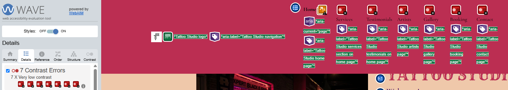
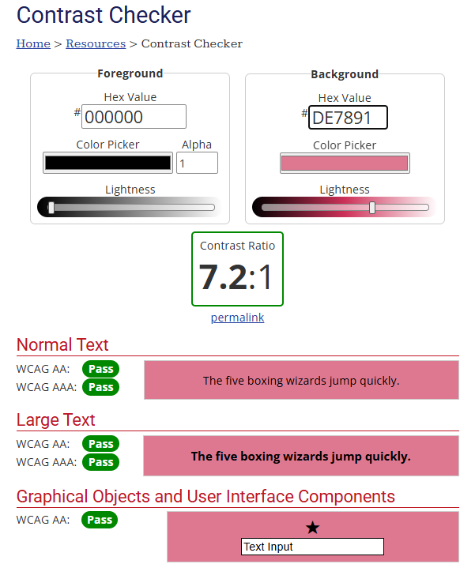

# Testing
----------
----------

## Contrast

Using the chrome extension: Wave, it came to my attention that the contrast was off for the text in the navigation bar and the footer

1. Checked contrast on Wave and it was showing 7 errors.

1. Wave shows 6 contrast errors in the navigation bar.

1. Wave shows 1 contrast error in the footer.

1. I used the contrast checker on webaim.org and found that my chosen colours failed mostly everything. 

1. I used the sliding scale to adjust the background colour lightness until I saw a pass on all tests and decided to use the salmon pink colour (#de7891) that was suggested.

1. I checked the wave extension again after I used the new background colour for the navigation bar and footer and no contrast errors came up so I decided to keep the newe colour as it matched the website colour scheme really well and would not cause any issues for sight impared users.

1. The navigation bar with the new colour.

1. The footer with the new colour.

