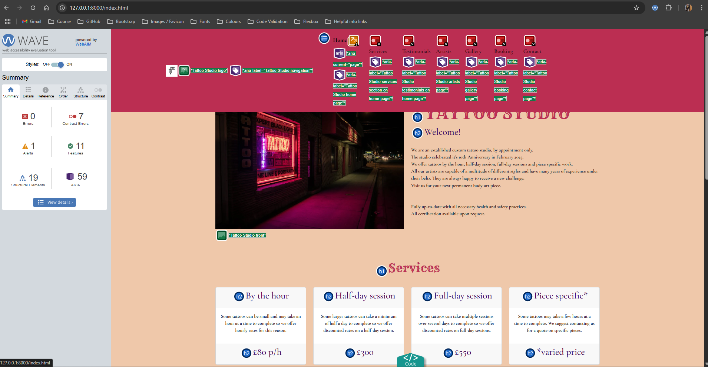
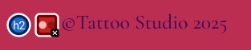
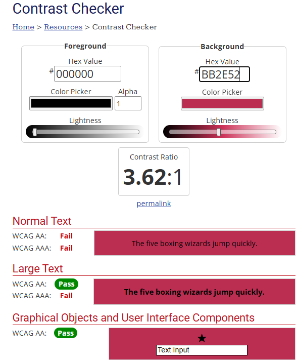
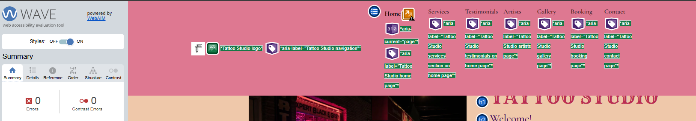
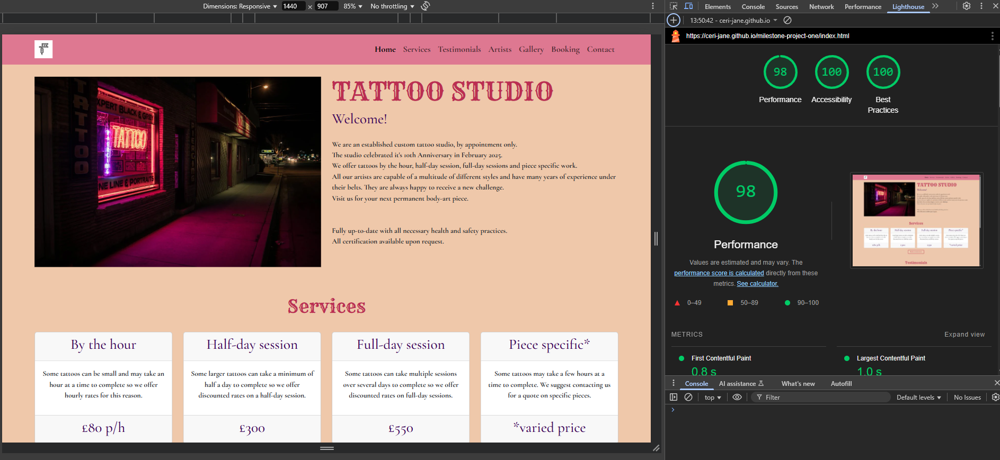
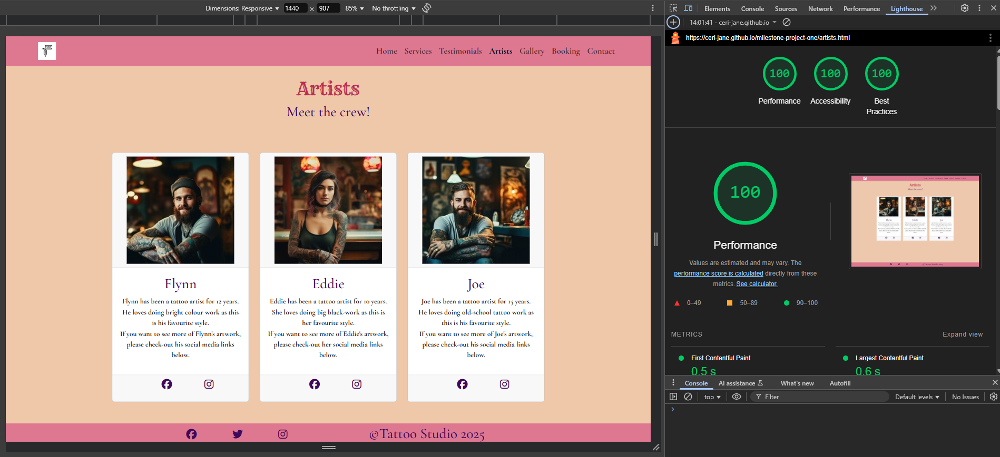
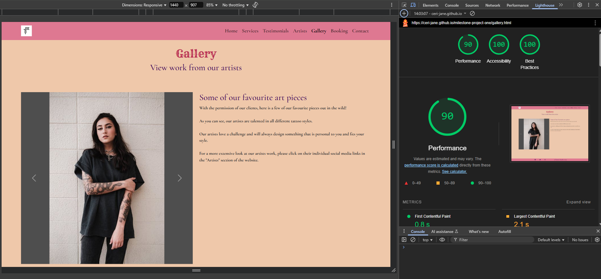
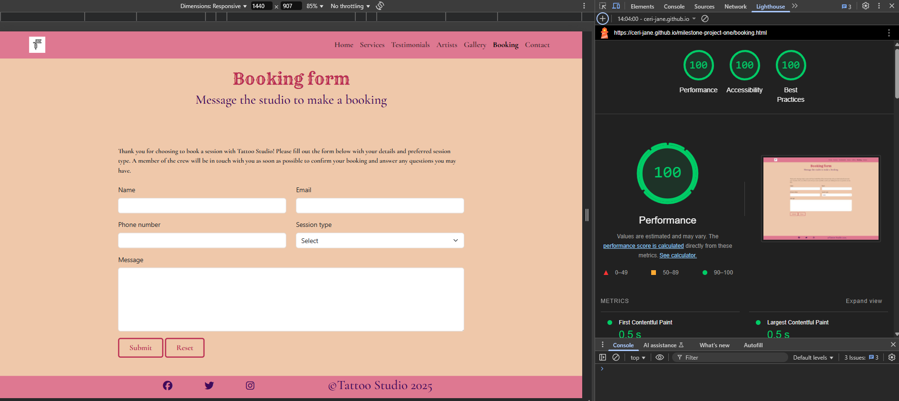

# Testing
----------
----------

## Contrast

Using the chrome extension: Wave, it came to my attention that the contrast was off for the text in the navigation bar and the footer

1. Checked contrast on Wave and it was showing 7 errors.

1. Wave shows 6 contrast errors in the navigation bar.

1. Wave shows 1 contrast error in the footer.

1. I used the contrast checker on webaim.org and found that my chosen colours failed mostly everything. 

1. I used the sliding scale to adjust the background colour lightness until I saw a pass on all tests and decided to use the salmon pink colour (#de7891) that was suggested.

1. I checked the wave extension again after I used the new background colour for the navigation bar and footer and no contrast errors came up so I decided to keep the newe colour as it matched the website colour scheme really well and would not cause any issues for sight impared users.

1. The navigation bar with the new colour.

1. The footer with the new colour.

Return to [README.md](README.md)

## Lighthouse

Here are my findings after using the Lighthouse chrome dev. tool on the deployed Tattoo Studio website.

1. Home page

No errors to fix. 98% on performance as the image uses .img-fluid class from Bootstrap and has no set width/height.

2. Artists page

No errors to fix.

3. Gallery page

No errors to fix. 90% on performance simply because there is a short load time for each image in the carousel.

4. Booking page

No errors to fix.

5. Success page

No errors to fix. 93% on accessibility because there is a meta tag used to redirect the user back to the home page after 10 seconds.

6. Contact page

All errors seem to be pointing towards the iframe element where the interactive map is embeded.

After removing the iframe map and entering a placeholder heading for testing, the scores went up significantly.

There isn't anything I am able to fix on the map as this has been taken from google maps.
My decision to leave this in means the scores will remain as follows;
* 99% Performance, 
* 96% Accessibility,
* 78% Best Practices.

Return to [README.md](README.md)

## ddd